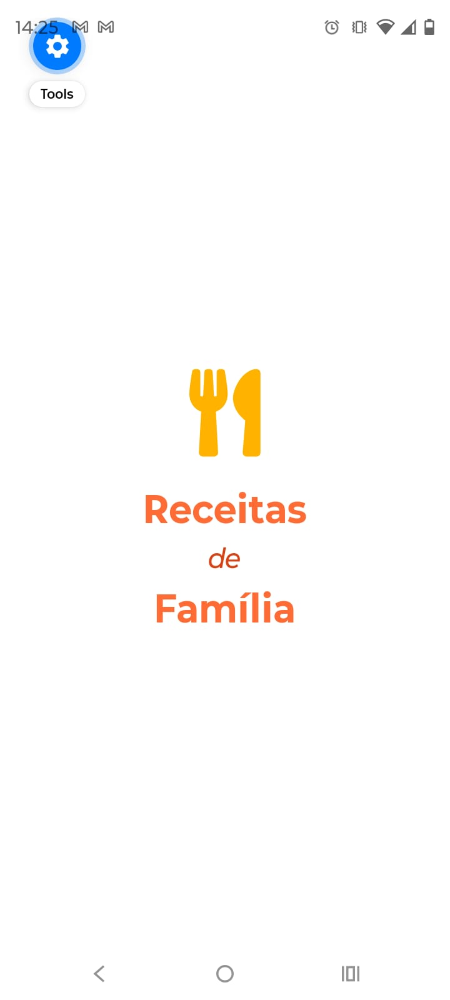
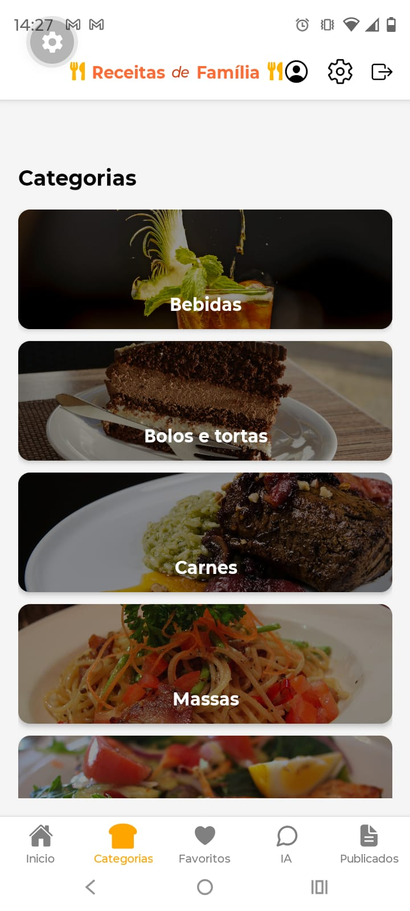
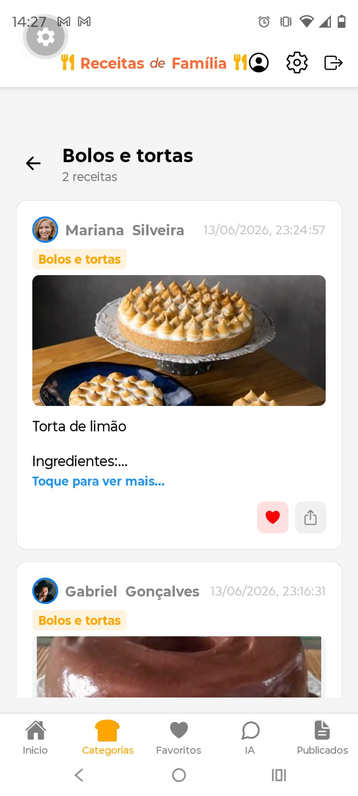
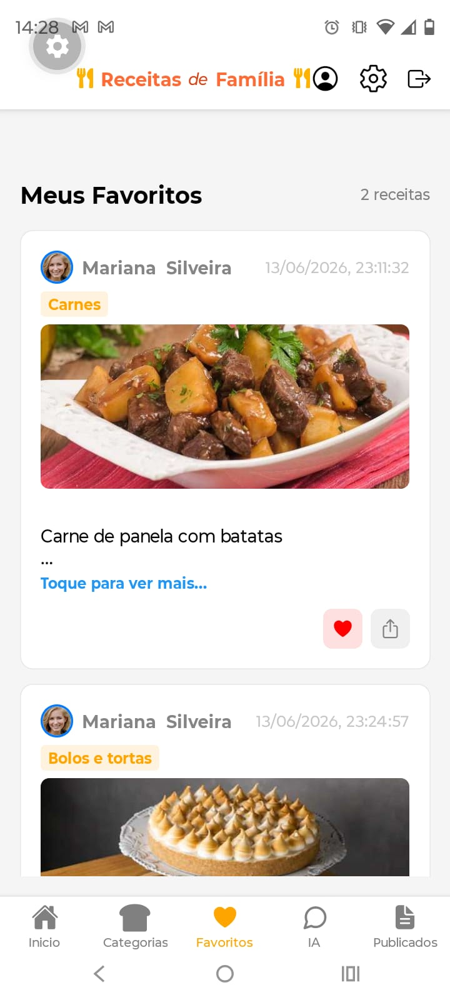
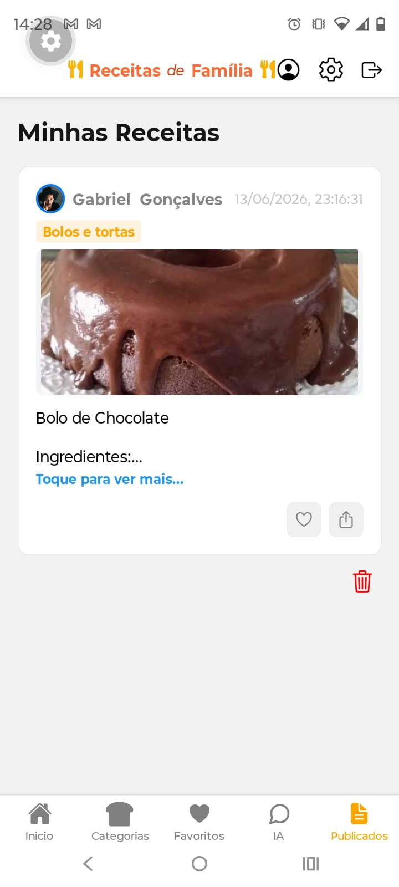
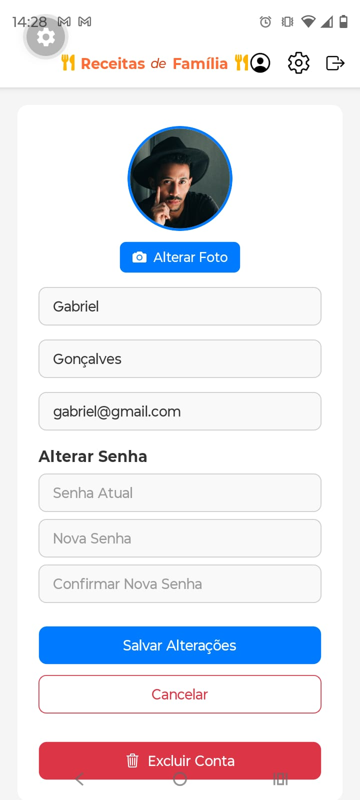
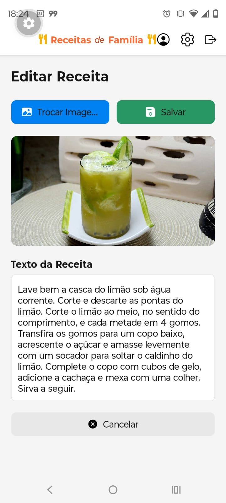

# 🍳 Receitas de Família

Um aplicativo mobile que funciona como uma rede social para compartilhamento de receitas. Os usuários podem publicar suas receitas favoritas, favoritar receitas de outros usuários, editar suas publicações e explorar receitas por categorias. Além disso, conta com uma IA integrada para responder dúvidas sobre culinária.

## ✨ Características Principais

- 👤 **Autenticação de Usuários**: Login e cadastro seguro com Firebase Authentication
- 📸 **Publicar Receitas**: Compartilhe suas receitas com foto, ingredientes e modo de preparo
- ❤️ **Favoritar Receitas**: Salve suas receitas favoritas para consulta rápida
- ✏️ **Editar Receitas**: Atualize suas receitas publicadas a qualquer momento
- 🏷️ **Categorias**: Navegue por diferentes categorias de receitas
- 🤖 **IA Assistente**: Chat com IA (Gemini) para tirar dúvidas sobre culinária
- 👥 **Perfil do Usuário**: Gerencie suas informações e receitas publicadas

## 🖼️ Screenshots

### Tela de Splash


### Tela Inicial (Home)


### Categorias de Receitas


### Detalhes da Categoria


### Receitas Favoritas
Aqui você visualiza todas as suas receitas favoritas organizadas e salvas.

### Assistente IA


### Minhas Receitas Publicadas


### Perfil do Usuário


### Edição de Receita


## 🛠️ Tecnologias Utilizadas

### Frontend
- **React Native + Expo**: Framework para desenvolvimento mobile multiplataforma
- **TypeScript**: Linguagem tipada para maior segurança e produtividade
- **Tamagui**: UI framework para styling e componentes

### Backend & APIs
- **Firebase Authentication**: Autenticação segura de usuários
- **Firestore**: Banco de dados em tempo real para armazenamento de receitas
- **Gemini API**: IA integrada para assistente de culinária
- **imgbb**: Serviço de hospedagem de imagens

## 🔐 Autenticação de Usuários

A autenticação foi implementada utilizando **Firebase Authentication**, permitindo que os usuários se registrem e façam login com email e senha de forma segura.

```typescript
// Exemplo de uso
import { auth } from './firebase';
import { createUserWithEmailAndPassword, signInWithEmailAndPassword } from 'firebase/auth';

// Cadastro
await createUserWithEmailAndPassword(auth, email, password);

// Login
await signInWithEmailAndPassword(auth, email, password);
```

## 📝 CRUD de Receitas

As operações de criar, ler, atualizar e deletar receitas foram implementadas no **Firestore**. Cada receita é armazenada como um documento na coleção `receitas`.

```typescript
import { collection, addDoc, getDocs, updateDoc, deleteDoc, doc } from 'firebase/firestore';
import { db } from './firebase';

// Criar receita
await addDoc(collection(db, 'receitas'), {
  titulo: 'Bolo de Chocolate',
  ingredientes: [...],
  modoPreparo: '...',
  categoria: 'Bolos e Tortas',
  autor: userId,
  imagemUrl: 'https://...',
  dataCriacao: new Date()
});

// Ler receitas
const receitas = await getDocs(collection(db, 'receitas'));

// Atualizar receita
await updateDoc(doc(db, 'receitas', receitaId), {
  titulo: 'Novo título',
  ...
});

// Deletar receita
await deleteDoc(doc(db, 'receitas', receitaId));
```

## 📸 Upload de Imagens

O upload de imagens é realizado através da **API do imgbb**. O aplicativo envia a imagem, recebe a URL gerada e a salva junto com os dados da receita no Firestore.

```typescript
// Exemplo de upload para imgbb
const uploadImageToImgbb = async (imageBase64: string) => {
  const formData = new FormData();
  formData.append('image', imageBase64);
  formData.append('key', IMGBB_API_KEY);

  const response = await fetch('https://api.imgbb.com/1/upload', {
    method: 'POST',
    body: formData
  });

  const data = await response.json();
  return data.data.image.url;
};
```

## 🤖 Integração com Gemini API

O assistente IA utiliza a **API do Gemini** para responder perguntas sobre culinária de forma inteligente e contextualizada.

```typescript
import { GoogleGenerativeAI } from '@google/generative-ai';

const genAI = new GoogleGenerativeAI(GEMINI_API_KEY);

const chat = async (message: string) => {
  const model = genAI.getGenerativeModel({ model: 'gemini-pro' });
  const result = await model.generateContent(message);
  return result.response.text();
};
```

## 📋 Categorias Disponíveis

- 🥩 Carnes
- 🍝 Massas
- 🎂 Bolos e Tortas
- 🥗 Saudável
- 🥤 Bebidas
- 🍤 Frutos do Mar
- 🌮 Lanches
- 🥄 Acompanhamentos

## 🚀 Como Instalar e Usar

### Pré-requisitos
- Node.js e npm/yarn instalados
- Conta no Firebase
- Chave API do Gemini
- Chave API do imgbb

### Instalação

1. Clone o repositório:
```bash
git clone https://github.com/Ritielen/App-de-receitas.git
cd App-de-receitas
```

2. Instale as dependências:
```bash
npm install
# ou
yarn install
```

3. Configure as variáveis de ambiente no arquivo `.env`:
```
FIREBASE_API_KEY=sua_chave_firebase
GEMINI_API_KEY=sua_chave_gemini
IMGBB_API_KEY=sua_chave_imgbb
```

4. Inicie o aplicativo:
```bash
npx expo start
```

5. Abra no seu dispositivo ou emulador usando o app Expo Go ou siga as instruções do terminal.

## 📱 Fluxo de Uso

1. **Splash Screen** → Apresentação do aplicativo
2. **Login/Registro** → Autenticar com email e senha
3. **Home** → Explorar receitas e publicar novas
4. **Categorias** → Filtrar receitas por categoria
5. **Favoritos** → Ver receitas salvas
6. **IA** → Conversar com o assistente de culinária
7. **Perfil** → Gerenciar dados e receitas publicadas

## 📂 Estrutura do Projeto

```
App-de-receitas/
├── assets/              # Imagens e recursos
├── components/          # Componentes reutilizáveis
├── hooks/              # Custom hooks
├── navigation/         # Navegação entre telas
├── screens/            # Telas da aplicação
├── services/           # Serviços (API, Gemini, etc)
├── firebase.ts         # Configuração Firebase
├── tamagui.config.ts   # Configuração Tamagui
└── App.tsx             # Componente principal
```

## 🤝 Contribuições

Contribuições são bem-vindas! Sinta-se livre para abrir issues e pull requests.

## 📄 Licença

Este projeto está sob a licença MIT.

---

**Desenvolvido com ❤️ para compartilhar as melhores receitas de família!**